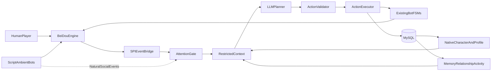

# LLM Companion Bot MVP

## Objective

Add a small cohort of persistent, LLM-guided companions on top of the existing
script-driven SoloMapling population. A companion owns a native BeiDou account
and character, a stable persona, decaying memories, relationships, knowledge,
and an online/offline routine. The LLM chooses infrequent high-level actions;
the existing deterministic bot state machines continue to execute movement,
combat, party, and trade mechanics.

The first playable milestone is:

1. A player naturally encounters one of three persistent companions.
2. They can chat, form a party, follow one another, and train together.
3. The companion can leave according to its routine and make bounded offline
   progress.
4. Server restarts preserve the same character, equipment, relationship, and
   salient memories.

Full boss tactics, quest reasoning, market speculation, and cash-shop behavior
are intentionally outside the first milestone.

## Repository and worktree layout

- Plugin source:
  `/Users/zmzeng12/Code/fork/worktrees/solomapling-llm-companion`
  on branch `feat/llm-companion-mvp`.
- BeiDou test-server source:
  `/Users/zmzeng12/Code/fork/worktrees/beidou-llm-companion`
  on branch `feat/llm-companion-mvp-host`, based on `beta`.
- `beta` currently has the same merge base as local `master`
  (`master...beta = 0/25`). Before integration, fetch and rebase only if the
  remote master has advanced.
- Runtime-only changes in the original beta checkout
  (`application.yml`, `log4j2-debug.xml`) must not be copied or committed.

## Architecture

### Boundaries

- LLM output is a versioned, structured action. It never receives a live
  `Character` reference and never calls engine methods directly.
- Initial action allowlist: `SAY`, `EMOTE`, `ACCEPT_PARTY`, `INVITE_PARTY`,
  `FOLLOW`, `GO_TO`, `TRAIN_WITH`, `REST`, and `GOODBYE`.
- Existing 100 ms/250 ms state-machine ticks never call an LLM. LLM turns are
  triggered by direct address, conversation continuation, party/trade invites,
  goal completion, or recovery from a stuck high-level task.
- Prompt context contains only current perception, learned knowledge, selected
  memories, and stable persona. It does not expose global WZ/server state.
- Ambient bots remain ephemeral clones and use YAML/scripts. Only registered
  companion character IDs use persistent behavior.

## Persistence model

Add Flyway-managed tables in the SoloMapling plugin. Plugin migrations use the
isolated `db/migration/solomapling` location and
`flyway_solomapling_schema_history`; the host owns only native account/character
schema and the generic provisioning transaction:

- `bot_profiles`: account/character identity, persona seed and text, routine
  settings, growth stage, current mode, and settlement timestamps.
- `bot_relationships`: familiarity, trust, affinity, and compact relationship
  summary between a companion and another character.
- `bot_memories`: episodic/semantic/commitment memories, tags, salience,
  strength, occurrence/recall times, and archive state.
- `bot_knowledge`: facts a companion has actually learned about maps, mobs,
  items, and people.
- `bot_activity_log`: auditable decisions, action outcomes, and offline
  settlements.

Persistent companions load with
`Character.loadCharFromDB(characterId, botClient, true)` and save through the
native `Character` persistence path. The legacy template-clone path remains for
ambient bots. Artificial-character classification becomes dynamic:
registered companion IDs plus the legacy `id > 20000 || id == 999` rule.

MVP memory retrieval stays in MySQL: filter by actor/map/tags, then rank by
salience, relationship, recency, and recall-strength decay. A low-frequency
consolidator summarizes repeated episodes and archives weak memories. A vector
database is deferred until scale demonstrates a need.

## Online and offline life

- A deterministic routine scheduler creates sleep, town, training, shopping,
  and social blocks from persona and level.
- Only companions whose schedule says online are spawned.
- Offline time is not simulated frame by frame. Before the next spawn, a
  bounded settlement calculates conservative experience, mesos, and ordinary
  item changes, records an audit entry, and saves the native character.
- Offline settlement cannot create boss drops, rare quest rewards, or cash
  items.
- An encounter director may softly weight a routine's already-valid candidate
  maps toward the player's progression. It cannot teleport an observed bot,
  and it applies per-player and per-companion cooldowns.

## Implementation phases

### Phase 0: baseline

- Build the plugin's existing 0.4.0-SNAPSHOT and host modules in the new
  worktrees.
- Confirm the current SocialBot DeepSeek/YAML hybrid tests still pass.
- Keep beta as the deployment baseline and avoid parallel edits in the older
  host checkout.

### Phase 1: persistent identity

- Add plugin-owned database migrations.
- Add plugin repositories, domain records, and a dynamic companion roster.
- Add persistent load/spawn/save/despawn paths without changing ambient bot
  generation.
- Add a controlled provision command for native bot accounts/characters. Never
  print or store provisioned passwords outside the account row.

### Phase 2: cognition and action

- Add stable persona generation and perception filtering.
- Add memory, relationship, knowledge, and activity services.
- Generalize the current LLM client behind a provider-neutral interface while
  retaining DeepSeek and YAML fallback.
- Add `CompanionBot`, attention gating, structured planning, validation, and
  action execution using existing movement/combat/party components.

### Phase 3: routine and offline progression

- Add routine scheduling, spawn/despawn transitions, encounter weighting, and
  bounded offline settlement.
- Add memory consolidation and forgetting.

### Phase 4: verification and operations

- Add `!companion list|inspect|spawn|despawn|think|memories|schedule|save`.
- Unit-test persona stability, memory decay, perception restrictions, action
  parsing/rejection, schedules, and offline caps.
- Integration-test persistent character load/change/save/reload and separation
  from legacy ambient bots.
- Manually verify the end-to-end player encounter and restart scenario.

## Completion criteria

- Three provisioned companions retain native identity and game state across two
  restarts.
- A companion remembers a salient interaction but weak ordinary chat decays.
- A companion is absent outside its schedule and receives only capped offline
  progress.
- Direct address can lead to conversation, party formation, following, and
  joint training.
- Invalid/timeout LLM responses cannot mutate game state and fall back safely.
- Existing ambient population, trade hooks, and SocialBot behavior do not
  regress.
